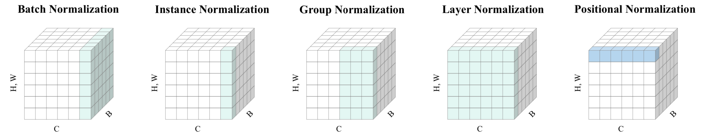
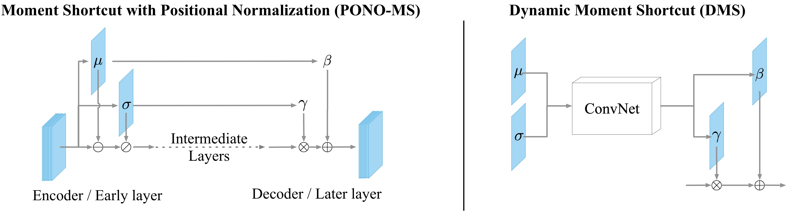

# Positional Normalization 
(NeurIPS 2019, Spotlight)
#### Authors: 
* [Boyi Li](https://sites.google.com/site/boyilics/home)*
* [Felix Wu](https://scholar.google.com.tw/citations?user=sNL8SSoAAAAJ&hl=en)*
* [Kilian Q. Weinberger](http://kilian.cs.cornell.edu/index.html)
* [Serge Belongie](https://vision.cornell.edu/se3/people/serge-belongie/)

*: Equal Contribution

### Overview
The repo contains TensorFlow and PyTorch Implementation of Positional Normalization (PONO) and Moment Shortcut (MS), described in the paper [Positional Normalization](http://papers.nips.cc/paper/8440-positional-normalization). 

This image illustrates how PONO differs from some popular nomalization methods:

In the figure, each subplot shows a feature map tensor, with B as the batch axis, C as the channel axis, and (H, W) as the spatial axis. The entries colored in green or blue (ours) are normalized by the same mean and standard deviation. Unlike previous methods, our method processes each position independently.

It's suggested to put PONOs right after convolution operations in the encoder (former layers) and MSs right before convolution operations in the decoder (latter layers). One may use a ConvNet taking μ and σ extracted from PONO as inputs to generate β and γ for MS, which we refer as Dynamic Moment Shortcut (DMS). Here we show the illustration.


Please feel free to check our [Video](https://youtu.be/r98mC3e8EAY) for more details.
### Explorations beyond our paper
#### Image Translation
Cross-domain Correspondence Learning for Exemplar-based Image Translation: [Pytorch Version](https://github.com/microsoft/CoCosNet)
#### Image Dehazing: 
Improved AOD-Net [Pytorch Version](https://github.com/Boyiliee/AOD-Net/tree/master/AOD-Net%20with%20PONO)
#### Image Classification / Detection (Data Augmentation):
Moment Exchange (MoEx) [Pytorch Version](https://github.com/Boyiliee/MoEx)
#### Others (Unofficial)
Semantic Segmentation: [Keras Version](https://github.com/sremes/a2d2)

#### More information and relevant applications will be updated.

If you find this repo useful, please cite:
```
@inproceedings{li2019positional,
  title={Positional Normalization},
  author={Li, Boyi and Wu, Felix and Weinberger, Kilian Q and Belongie, Serge},
  booktitle={Advances in Neural Information Processing Systems},
  pages={1620--1632},
  year={2019}
}
```
